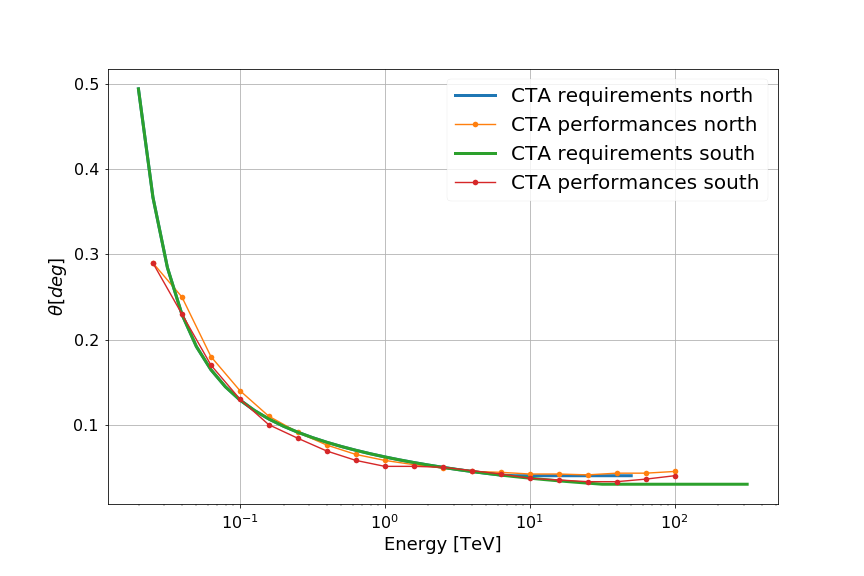
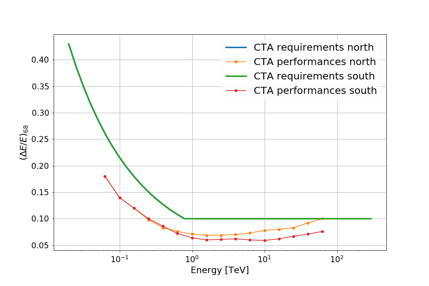
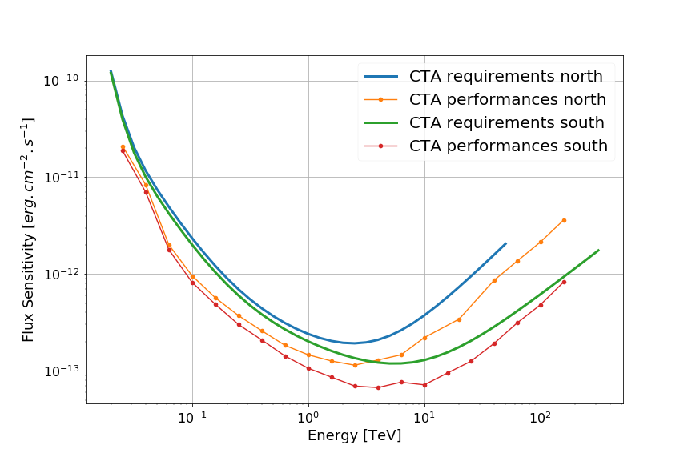

small collection of function to make useful plots for Imaging Atmospheric Cherenkov Telescopes
==============================================================================================

Given a list of reconstructed and simulated quantities, compute and plot the Instrument Response Functions:

* angular resolution
* energy resolution
* effective surface
* impact point resolution

----

* Code : https://github.com/vuillaut/ctaplot
* Author contact: Thomas Vuillaume - thomas.vuillaume@lapp.in2p3.fr
* License: MIT

----

Install:
--------

Required packages:

* numpy  
* scipy>=0.19    
* matplotlib>=2.0   

We recommend the use of `anaconda <https://www.anaconda.com>`_

In the ctaplot directory:   

.. code-block::

   python setup.py install

----

Examples
--------

.. image:: share/images/CTA_effective_area.png
   :target: share/images/CTA_effective_area.png
   :alt: CTA effective area

