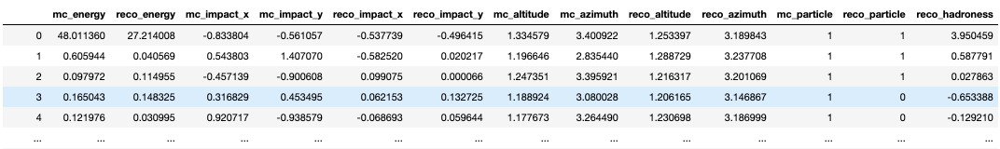

=================================
Supported data formats in ctaplot
=================================

Most of the functions in ctaplot use `Numpy` arrays as input.
However, GammaBoard reads results directly from HDF5 files. Two file structures are currently supported:

GammaBoard file format
----------------------

Datasets in the HDF5 file are tables that can be opened with
::

    pandas.read_hdf(filename, key=dataset_name)

* `data` - mandatory

Contains the reconstructed values

Columns names:
::

    `mc_energy`: float
    `reco_energy`: float
    `mc_impact_x`: float
    `mc_impact_y`: float
    `reco_impact_x`: float
    `reco_impact_y`: float
    `mc_altitude`: float
    `mc_azimuth`: float
    `reco_altitude`: float
    `reco_azimuth`: float
    `mc_particle`: int 0 or 1
    `reco_particle`: int 0 or 1
    `reco_hadroness` or `reco_gammaness`: float between 0 and 1

* `triggered_events` - optional
Single column table containing the list of triggered events energies:

Column name:
::

    `mc_trig_energies`

* `simuluation/run_config` - mandatory to plot the effective area

Contains the simulation information from each simulation file used (1 file per line):

Column names:
::

    `energy_range_max`
    `energy_range_min`
    `max_alt`
    `max_scatter_range`
    `min_alt`
    `num_showers`
    `shower_reuse`
    `spectral_index`

`lstchain <https://github.com/cta-observatory/cta-lstchain>`_ DL2 file format
------------------------

Datasets:

* `dl2/event/telescope/parameters/LST_LSTCam`

Contains the reconstructed values

Column names: same as the GammaBoard format (see above) OR :
::
    `mc_alt`: float
    `mc_az`: float
    `mc_core_distance`: float
    `mc_core_x`: float
    `mc_core_y`: float
    `mc_energy`: float
    `mc_h_first_int`: float
    `mc_type`: : int following the simtel convention: 0 for gamma, 1 for electron, 101 for protons
    `mc_x_max`: float
    `reco_energy`: float
    `reco_src_x`: float
    `reco_src_y`: float
    `reco_alt`: float
    `reco_az`: float
    `reco_type`: int following the simtel convention: 0 for gamma, 1 for electron, 101 for protons
    `gammaness`: float between 0 and 1

* `simulation/run_config` - mandatory to plot the effective area

Contains the simulation information from each simulation file used (1 file per line):

Column names:
::
    `energy_range_max`
    `energy_range_min`
    `max_alt`
    `max_scatter_range`
    `min_alt`
    `num_showers`
    `shower_reuse`
    `spectral_index`

Note: in the future, ctaplot will support the official CTA DL1 and DL2 file formats.

GammaBoard experiments directory structure
------------------------------------------

GammaBoard loads experiments data from a single directory where all experiments are stored
You may want to export the path to this directory as:

::

    GAMMABOARD_DATA=path_to_the_data_directory

In this directory, each sub-directory is an experiment containing:

* experiment_name.h5 : Mandatory - file containing the reconstructed quantities as described above.

* experiment_name.json : Optional - file containing information regarding the experiment. It can be anything compliant with the json format.

Example of GAMMABOARD_DATA directory
************************************

::

    GAMMABOARD_DATA
        ├── exp_01
        |    ├── exp_01.h5
        |    └── exp_01.json
        └── the_awesome_exp
             ├── the_awesome_exp.h5
             └── the_awesome_exp.json

